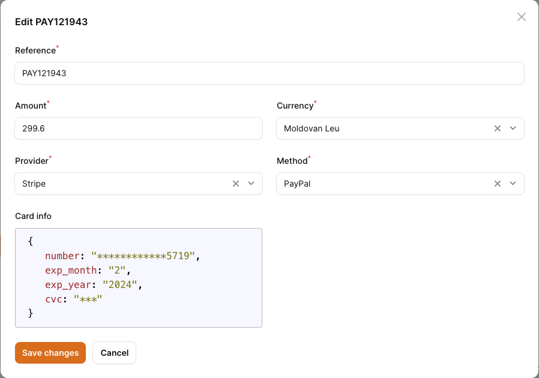

# novadaemon/filament-pretty-json

Read-only field to show pretty json in your [filamentphp](https://filamentphp.com/) forms.

## Installation

You can install the package via composer:

```bash
composer require novadaemon/filament-pretty-json
```

This package supports Laravel 9 and Laravel 10.

## Usage

Simply use the component as you'd use any other Filament field. It's especially perfect for the resource view page where it blends right in.

```php
use Novadaemon\FilamentPrettyJson\PrettyJson;

class FileResource extends Resource
{
    public static function form(Form $form): Form
    {
        return $form
            ->schema([
                PrettyJson::make('json')
            ]);
    }
}
```

The value of the field can be casting to array, object, json, string, AsArrayObject or object that implements Jsonable interface

```php
/**
 * @var string[]
 */
protected $casts = [
    'card_info' => AsArrayObject::class
];
```

## Customize

Optionally, you can publish the views using

```bash
php artisan vendor:publish --tag="filament-pretty-json-views"
```

Also, you can overwrite the css rules in your stylesheets.

```css
pre.prettyjson {
    color: black;
    background-color: ghostwhite;
    border: 1px solid silver;
    padding: 10px 20px;
    border-radius: 4px;
    overflow: auto;
}

:is(.dark) pre.prettyjson {
    opacity: .7;
    --tw-bg-opacity: 1;
    --tw-border-opacity: 1;
    background-color: rgb(55 65 81/var(--tw-bg-opacity));
    border: 1px solid rgb(75 85 99/var(--tw-border-opacity));
    color: rgb(209 213 219/var(--tw-text-opacity));
}

:is(.dark) pre.prettyjson span.json-key {
    color: red !important;
}

:is(.dark) pre.prettyjson span.json-string {
    color: aquamarine !important;
}

:is(.dark) pre.prettyjson span.json-value {
    color: deepskyblue !important;
}
```

## Contributing

Contributing is pretty chill and is highly appreciated! Just send a PR and/or create an issue!

## Credits

- [All contributors](https://github.com/novadaemon/filament-pretty-json/contributors)

## License

The MIT License (MIT). Please see [License File](LICENSE.md) for more information.

<div class="filament-hidden">
    <h2>Screenshot</h2>
    
</div>